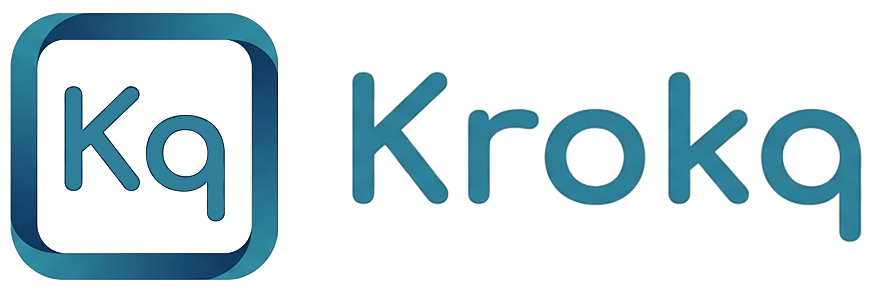

  

A light, adaptable task tracker and chat with a built-in AI assistant, under one shell. Completely free.

# Krokq (pronounced [krok])

Think "Jira, but a lot simpler". Adaptable is the point: through simple connections Krokq bends to whatever a team actually needs, instead of forcing the team to bend to the tool. And now there is a built-in AI assistant, so you can create a task just by speaking.

This is the public repo about Krokq: what it is, why it exists, and what it can do. The application code itself is closed.

## Why

In small teams the conversation gets scattered across several messengers, while tasks and results are tracked nowhere. The big all-in-one suites solve that on paper, but they are heavy and overloaded. Krokq fills exactly this gap: no clutter, tasks and communication in one place.

## The main idea

You move freely between Chat and Tasks:

- turn a chat message into a task in one click
- jump from a task straight into a private chat with a person
- or keep the discussion right inside the task

The chat itself feels like the messengers you already use, so there is almost nothing to learn. And this is where the adaptable part comes in: Krokq connects to the services your team already works with, and their content shows up right inside the app. The first two connect to WordPress, both read only through the backend. New connections get added for real requests, so the tool keeps shaping itself around the work.

## What it can do

Tasks:

- a built-in AI assistant: create a task by voice, in plain words, in any of 10 languages
- a real workflow: New, In progress, Rework, In review, Done, plus Trash and Archive
- custom task types, a board with columns, urgent items
- threaded comments with reactions, attachments, search
- status based permissions, assignment, acceptance and send back for rework

Chat:

- talk to colleagues, drafts, edit, delete, forward
- reactions, voice messages with a waveform, drag and drop attachments, paste from clipboard
- presence and read receipts, quoting and reply

The app:

- installs as a PWA on Android, iOS and desktop
- Web Push and an unread counter on the app icon
- share files into the app
- 10 languages
- sign in with a login or Google OAuth
- demo data in one click, lives for 24 hours

## Built on

Krokq runs on LaraFoundry, my own SaaS engine package (companies, users, roles, authentication). Krokq is the third application built on that engine.

## Links

- App: https://krokq.com
- LaraFoundry engine: https://larafoundry.com
- How it works (dev.to): https://dev.to/d_isaenko_dev/meet-krokq-a-light-adaptable-task-tracker-and-chat-under-one-shell-adf
